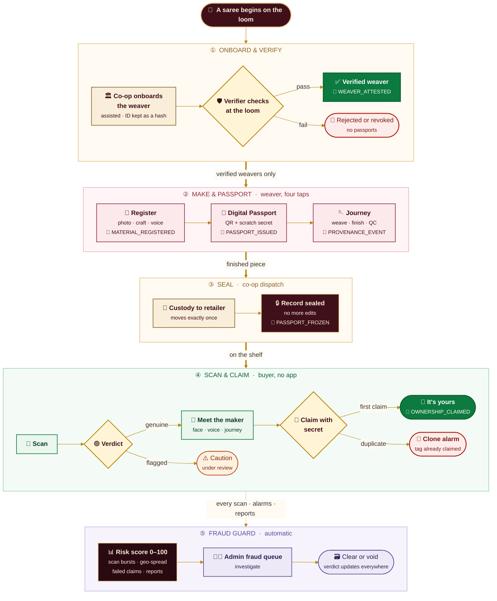
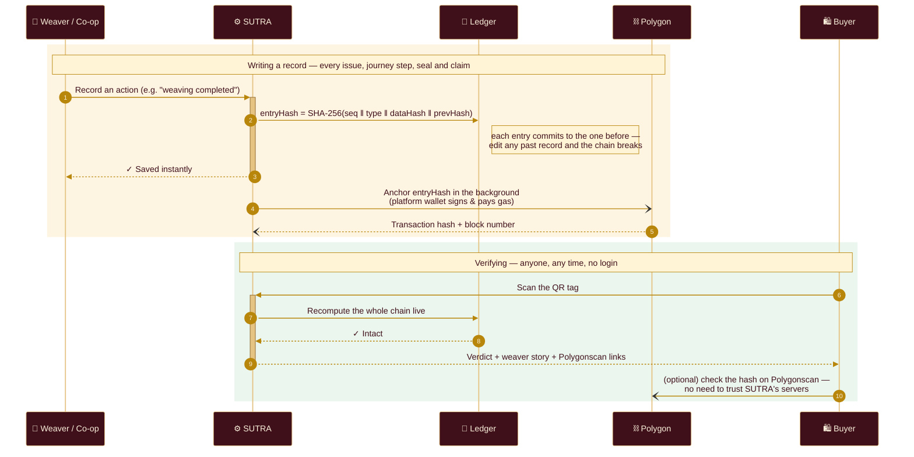

# SUTRA — Every thread has a story

**Digital Product Passports for genuine Indian handloom.**
Scan the tag, meet the weaver, verify the craft — backed by in-person verification and a
tamper-evident record anchored on a public blockchain.

🔗 **Live pilot:** [handloom-gray.vercel.app](https://handloom-gray.vercel.app) ·
▶️ **Interactive product journey:** [handloom-gray.vercel.app/how-it-works](https://handloom-gray.vercel.app/how-it-works)

---

## 🧭 The product journey

> **Tip:** hover the diagram on GitHub and use its controls to **zoom, pan or open it full screen**.

🔗 = a record written to the hash-chained ledger and anchored on Polygon.

### 🔐 What happens under the hood

### 🔎 Click a stage to see the details

<b>① Onboard & verify — Co-op officer + Verifier</b>

| | |
|---|---|
| **Who** | A cooperative officer registers the weaver; a verifier (co-op officer or Weavers' Service Centre official) visits the loom |
| **What happens** | Identity, loom and craft are checked in person. Government ID numbers are never stored — only a hash |
| **Recorded** | `WEAVER_ATTESTED` — the human attestation that is the root of trust |
| **Can fail?** | Yes — a rejected or later-revoked weaver cannot issue passports, and a revocation shows on every existing passport |
| **In the app** | `/coop/weavers/new` → `/admin/verify` |

<b>② Make & passport — Weaver</b>

| | |
|---|---|
| **Who** | The weaver, on a phone — four taps |
| **What happens** | Photo on the loom (compressed on the phone, location metadata stripped), craft, type and a voice note. Yarn, zari and dye lots are linked by grams. Then a Digital Passport is issued: a QR tag plus an 8-character scratch secret |
| **Recorded** | `MATERIAL_REGISTERED`, `PASSPORT_ISSUED`, `TAG_BOUND`, then one `PROVENANCE_EVENT` per journey step |
| **Why it's safe** | Only a hash of the scratch secret is stored — even the database can't reveal it |
| **In the app** | `/w/register` → `/w/products/{id}` · `/w/materials` |

<b>③ Seal — Co-op dispatch</b>

| | |
|---|---|
| **Who** | The cooperative, when the piece leaves for a retailer |
| **What happens** | Custody transfers (a piece dispatches exactly once) and the record **freezes** — exactly when the incentive to falsify appears, editing becomes impossible |
| **Recorded** | `PASSPORT_FROZEN` |
| **In the app** | `/coop/products` |

<b>④ Scan & claim — Buyer</b>

| | |
|---|---|
| **Who** | Any buyer — no app, no account |
| **What happens** | Scanning shows a verdict (genuine · pending · flagged · voided), the weaver's face and voice, materials and the full journey. The proof page re-checks the whole hash chain live. Claiming with the scratch secret records ownership |
| **Recorded** | `OWNERSHIP_CLAIMED` — scans themselves aren't ledger entries; they feed the risk score |
| **Clone detection** | A second claim on an already-claimed tag triggers a counterfeit alarm |
| **In the app** | `/p/{passportId}` → `/p/{passportId}/claim` · `/purchases` |

<b>⑤ Fraud guard — automatic + Admin</b>

| | |
|---|---|
| **Signals** | Duplicate claim (80) · consumer report (35) · repeated failed claims (30) · scan bursts (25) · same tag in 3+ cities within 24 h (20) → a 0–100 risk score |
| **What happens** | High-risk or flagged pieces show a caution on their public page and land in the admin fraud queue, where they are cleared or voided |
| **In the app** | `/report` · `/admin/fraud` |

▶️ Prefer clicking through it? Try the [interactive walkthrough](https://handloom-gray.vercel.app/how-it-works) — one saree, eight stages, with the screen each person sees.

---

## The problem

A Kanjivaram saree can take 120 hours on a handloom. A power-loom imitation takes 40 minutes —
and to most buyers, the two look the same on a shelf or a product page.

- **Buyers can't tell genuine from fake**, so they either overpay for imitations or stop paying
  a premium altogether.
- **Weavers are invisible.** The person who made the piece has no name, no face and no share of
  the story that sells it.
- **Existing marks are easy to copy.** A printed label or certificate is just paper; it proves
  nothing once it is photocopied or moved to another product.
- **Cooperatives and retailers lack proof** they can hand to a customer, a marketplace or an
  export buyer.

## What SUTRA does

Every genuine piece gets a **Digital Product Passport**: a QR tag linked to a public page that
shows who wove it, where, how, with what materials, and every step it took from yarn to shelf.

| | |
|---|---|
| **Proves origin** | The weaver's identity and loom are verified in person by a cooperative officer or Weavers' Service Centre official. |
| **Tells the story** | The weaver's face, voice note, village and craft travel with the piece — the story that justifies the price. |
| **Stops tampering** | Every event is written to an append-only, hash-chained ledger and anchored on the Polygon blockchain, so no record can be quietly edited later. |
| **Catches clones** | A scratch-panel secret on each tag lets a buyer claim ownership; a second claim on the same tag raises a counterfeit alarm. |

## How it works

1. **The weaver registers the piece** — one photo on the loom, the craft, the type and an
   optional voice note. Four taps on a phone.
2. **A verifier vouches for the weaver** — a human attestation, made at the loom, recorded
   permanently.
3. **A passport is issued** — the piece receives a QR tag and a hidden scratch secret. Journey
   steps (weaving, finishing, quality check, dispatch) are added as they happen. **Dispatch seals
   the record** — exactly when the incentive to falsify appears, the record becomes read-only.
4. **The buyer scans** — no app, no login. In seconds they see a clear verdict, the weaver, the
   materials and the full journey, and can claim the piece as theirs.

> **See it step by step:** the [interactive product journey](https://handloom-gray.vercel.app/how-it-works)
> walks one saree through all eight stages, with the screen each person sees and the ledger entry
> written at each step. Autoplay, click, swipe or use the ← → keys.

## Who it's for

| Stakeholder | Their problem | What SUTRA gives them |
|---|---|---|
| **Buyers** | "Is this really handloom? Who made it?" | A two-second answer on their phone, the maker's story, and proof of ownership they can revisit any time. |
| **Weavers** | Invisible, under-credited, underpaid | A public profile, credit on every piece, and insight into who viewed and scanned their work. |
| **Cooperatives** | No scalable way to prove authenticity | Assisted weaver registration, a verification workflow, custody tracking and customer campaigns. |
| **Retailers & marketplaces** | Counterfeit risk and returns | Sealed custody records, an embeddable "Verified by SUTRA" badge and a public API to show proof on product pages. |
| **Government & GI bodies** | Enforcing Handloom Mark, Silk Mark and GI claims | Certificates attached to each passport, and fraud reports with risk scores in one console. |

## Why buyers can trust it

SUTRA is honest about what technology can and cannot prove. **Technology proves a claim was made
and never altered afterwards; a person proves the claim was true.** SUTRA combines both.

**1. Human verification at the source.**
A verifier physically confirms the weaver's identity and loom. That attestation is the root of
trust. It can expire or be revoked, and a revocation is visible on every passport.

**2. A passport that can't be copied.**
Each QR tag carries a public passport ID plus an 8-character scratch secret. Only a hash of the
secret is stored, so even the database can't reveal it. Claiming ownership needs the physical
tag in hand.

**3. A tamper-evident record.**
Every action (passport issue, journey step, certificate, claim, seal) becomes a ledger entry
whose SHA-256 hash includes the previous entry's hash. Changing any past record breaks the
chain, and the public **proof page** re-checks the whole chain live, in front of the buyer.

**4. Anchored on a public blockchain.**
Each ledger entry's hash is also written to **Polygon** through **Alchemy**. Anyone can click
through from a product's journey to the real transaction on Polygonscan and confirm the hash
matches. No weaver, cooperative or buyer ever handles a wallet, key or gas fee; one platform
account signs and pays for every anchor in the background. Each anchor costs a fraction of a cent.

**5. Active fraud detection.**
A duplicate ownership claim, bursts of scans, the same tag scanned in several cities within a
day, repeated failed claims and consumer reports all feed a 0–100 **risk score** per product. Flagged pieces show a clear caution on their public page and land in an
admin fraud queue for investigation.

## Built for the realities of the field

- **Phone-first.** It installs to the home screen like an app, with a shop-style layout and a
  bottom tab bar. It works on low-end Android phones and iPhones alike.
- **No app or account for buyers.** Scan, browse, verify and look up purchases by phone number.
- **Low-literacy friendly.** Photo-and-tap registration, voice notes instead of typing, and
  big buttons.
- **Light on data.** Photos are compressed on the phone before upload, images are resized per
  device, and pages are cached at the edge.
- **Degrades gracefully.** If the blockchain is slow, the local ledger keeps working and records
  show as "pending" until they're anchored. Buyers are never shown an error in place of a verdict.
- **Privacy by design.** Government ID numbers are never stored (only a hash). Photo metadata,
  including GPS location, is stripped before upload. A weaver's record can be crypto-shredded on
  request.

## Tools for growth

- **Storefront & discovery.** A browsable collection with search, craft and type filters, and
  maker profiles, so authenticity becomes a reason to buy.
- **Weaver insights.** "Who saw my work": scans, reach and pieces that found a home.
- **Cooperative campaigns.** Push-notification campaigns to opted-in customers, such as new
  arrivals, festive collections and restocks, sent straight from the cooperative portal.
- **Embeddable proof.** A live "Verified by SUTRA" SVG badge and a public passport API
  (`/api/v1/passports/{id}`) for marketplaces, brand sites and export buyers.

## Business model *(proposed)*

| Revenue line | Who pays | For what |
|---|---|---|
| **Per-passport fee** | Cooperatives, brands | Issuing a tag and passport for each certified piece |
| **Verification as a service** | Cooperatives, GI & mark bodies | Running and recording in-person weaver verification |
| **Marketplace / API plan** | Retailers, e-commerce platforms | Badge embeds, API access and bulk authenticity checks |
| **Growth tools** | Cooperatives, retailers | Customer campaigns and audience insights |

Buyers never pay to verify. Free, instant verification is what makes the passport valuable to
everyone else.

## What we measure

The platform tracks the numbers that show both trust and impact, and they are visible live on
the home page and admin overview:

- **Verified weavers** and **passports issued**, the supply of provably genuine handloom
- **Consumer scans** and **ownership claims**, i.e. buyer engagement and conversion
- **Fraud reports and clone alarms**, the counterfeit pressure caught
- **Ledger records and on-chain anchors**, the integrity coverage

## Status & roadmap

**Today (pilot):** end-to-end flows for weavers, cooperatives, verifiers, admins and buyers;
live on Vercel with MongoDB Atlas; blockchain anchoring on the Polygon **Amoy testnet**.

**Next:**
- Polygon mainnet anchoring, with gas sponsored through Alchemy Gas Manager
- A production SMS OTP provider (MSG91 / Twilio) for sign-in
- Multilingual voice stories (transcripts and translations)
- Field-level encryption of personal data (MongoDB CSFLE)
- Printed tamper-evident tag partners and cooperative onboarding at scale

## Platform at a glance

| Layer | Technology |
|---|---|
| Web app & API | Next.js 15 (React 19, server rendering and edge caching), hosted on Vercel |
| Data & media | MongoDB Atlas; photos and voice notes in GridFS |
| Integrity | SHA-256 hash-chained ledger, anchored on Polygon via Alchemy (ethers.js) |
| Identity | Phone OTP sign-in; role-based portals for weavers, co-ops, verifiers and admins |
| Engagement | Installable web app (PWA) with web-push campaigns |

---

*Developers: demo logins and tag secrets are generated into `DEMO.md` by `npm run seed`;
blockchain setup is in [`BLOCKCHAIN.md`](BLOCKCHAIN.md).*
